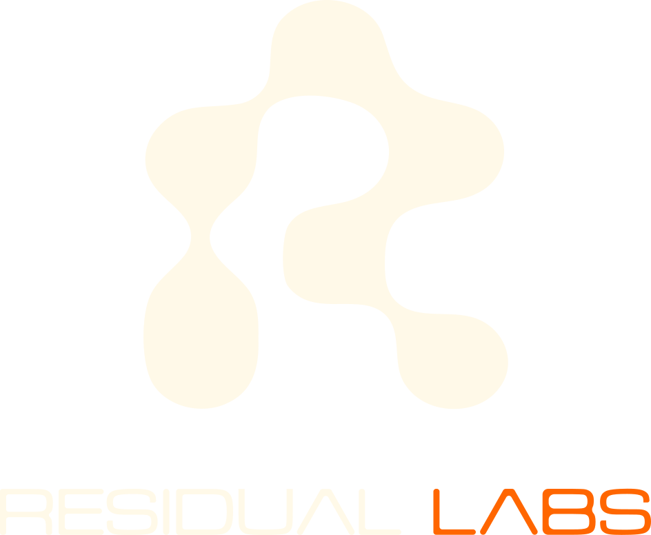

  
   
  <h1>Zakaria Gharzouli</h1>
  <h3>Founder &amp; Principal Engineer @ <a href="https://residual-labs.fr">Residual Labs</a> · Systems &amp; Verification</h3>
  
<i>I build proof-grade tools for problems that can't afford to be wrong. We don't pitch — we prove.</i>

---

## 🧠 About Me
I build **proof-grade tools**: deterministic, offline, and honest about their own limits — instruments that don't guess and never claim more than they can prove. Self-taught, proven by the work. My focus is **systems & verification** — making software provably correct where getting it wrong isn't an option.

## ⚡ Flagship: SPARDA
[**SPARDA**](https://github.com/zyx77550/sparda) is the trust layer for AI-written code, developed by Residual Labs.

> **"AI writes. SPARDA proves."**
> Compile Express, FastAPI, Next.js, Prisma, or any OpenAPI spec into a deterministic behavior graph to review every PR's behavior, prove security constraints, simulate APIs, and connect AI agents safely.

* **review** : Diff every PR's behavior (guards dropped, blast radius grown, new endpoints) as a sticky comment in your CI.
* **apocalypse** : Statically *prove* a deploy is safe — no guard, invariant, transaction or aggregate broken (SARIF + GitHub Security).
* **timeless** : Record a production request's nondeterminism, replay it byte-identically, export the bug as a Vitest test.
* **heal** : Close the loop — bug → fix → the machine *proves* the fix is correct and breaks nothing.
* **mirror** : Host a mock HTTP server directly from `ubg.json` — no code, no framework, enforces state machine and guards.
* **ubg --openapi** : Compile Go, Java, Rails, Laravel, or .NET APIs into the graph via their OpenAPI spec.
* **verify** : Prove the compiler's own laws (determinism, soundness, round-trip) on your app.

---

## 🚀 Residual Labs — the tool foundry
Residual Labs builds proof-grade tools, one strong pain at a time. **SPARDA is the first instrument, not the last.**
- [**SPARDA**](https://github.com/zyx77550/sparda) — The trust layer for AI-written code: CLI proof engine + agent edit-loop gate + MCP runtime.
- *Earlier products* — [Residual Audit](https://audit.residual-labs.fr), [Reach](https://reach.residual-labs.fr), [Publish](https://publish.residual-labs.fr), [QR](https://qr.residual-labs.fr): the lab's first B2B tools, where the proof-grade discipline was forged.

---

## ⚙️ Engineering Philosophy
- **Prove, don't claim:** deterministic outputs, a soundness contract, never a false green.
- **Honest about limits:** the tool reports its own blind spots and coverage — no overclaiming.
- **Zero-Bullshit UX:** minimalist, functional, fast. Security first (RLS, BYOK, AES-256-GCM).

## 🛠️ Core Stack

  
  
  
  
  
  

 

  
  
  

