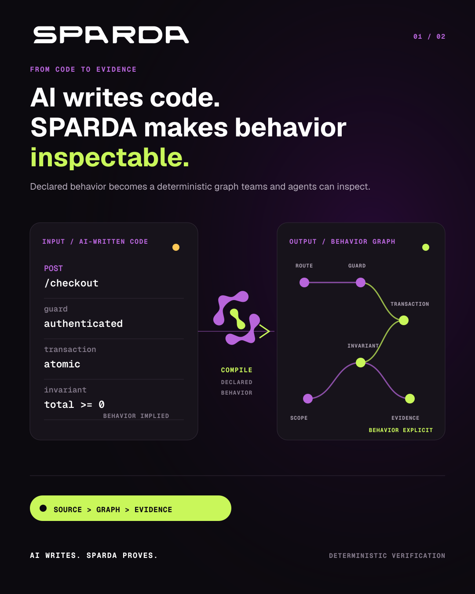
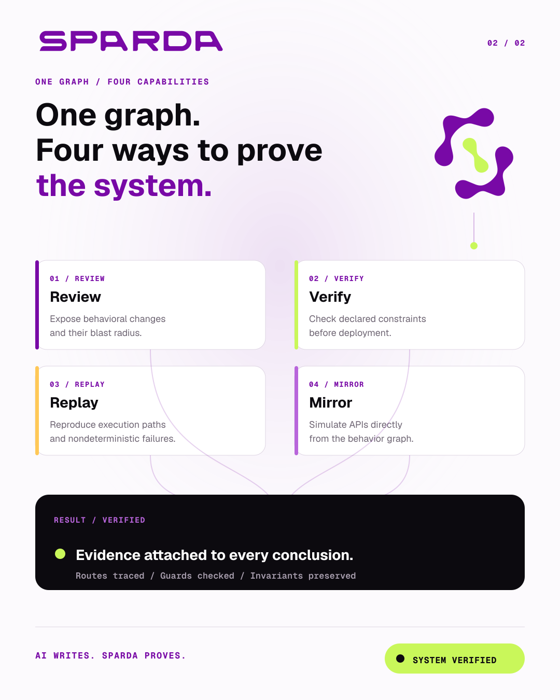
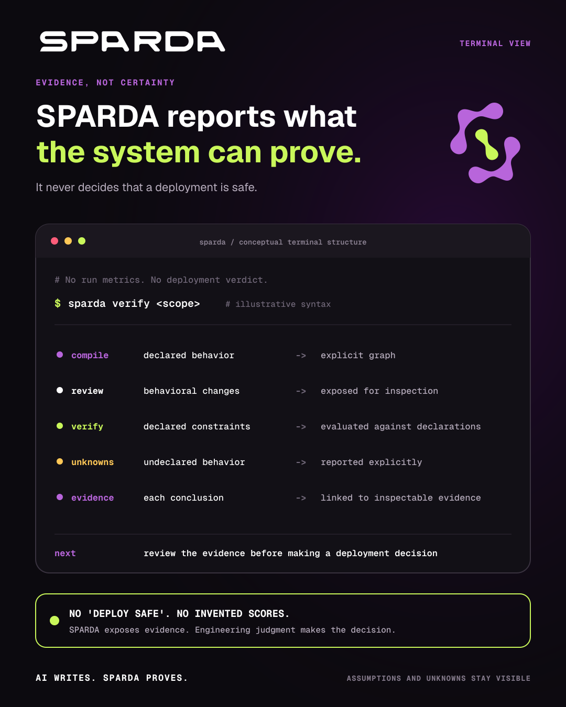

  

<h1 align="center">Zakaria Gharzouli</h1>

  <strong>Founder &amp; Principal Engineer at <a href="https://residual-labs.fr/">Residual Labs</a></strong> 
  Systems · Verification · Applied AI

  
  
  
  

<em>When the noise clears, the system remains.</em>

---

## About

I design software systems for work that cannot rely on approximation alone:
tools that are inspectable, deterministic where it matters, and explicit about
their limits.

My work sits at the intersection of AI, software architecture, automation, and
verification — turning complex behaviour into systems that teams can understand,
test, and operate with confidence.

---

## SPARDA

  

[**SPARDA**](https://github.com/zyx77550/sparda) is the verification layer for
AI-written code.

> **AI writes. SPARDA proves.**

SPARDA compiles an application's declared behaviour into a deterministic graph.
It gives developers and AI agents a concrete model to inspect changes, verify
constraints, simulate APIs, and trace what a system is allowed to do.

  
  
  
  

<table>
  <tr>
    <td width="50%" valign="top">
      <strong>Review</strong> 
      Expose behavioural changes across pull requests: routes, guards, invariants, transactions, and blast radius.
    </td>
    <td width="50%" valign="top">
      <strong>Verify</strong> 
      Check declared constraints and compiler laws before deployment.
    </td>
  </tr>
  <tr>
    <td width="50%" valign="top">
      <strong>Replay</strong> 
      Capture execution paths and replay nondeterministic failures for debugging and regression tests.
    </td>
    <td width="50%" valign="top">
      <strong>Mirror</strong> 
      Simulate APIs from the compiled behaviour graph without recreating the original application manually.
    </td>
  </tr>
  <tr>
    <td colspan="2" valign="top">
      <strong>Agent runtime</strong> 
      Connect AI agents to an explicit, controlled system model through MCP.
    </td>
  </tr>
</table>

SPARDA does not replace engineering judgement. It surfaces evidence, assumptions,
unknowns, and declared constraints so the system is easier to inspect, question,
and verify.

<table>
  <tr>
    <td width="50%" valign="top">
      
    </td>
    <td width="50%" valign="top">
      
    </td>
  </tr>
</table>

Conceptual product views — not output from a live run. No run metrics or deployment verdict are implied.

  
<strong>Terminal view — evidence without a deployment verdict</strong>

   
  

    
  

---

## Residual Labs

[**Residual Labs**](https://residual-labs.fr/) is a laboratory of engineering,
applied research, and digital systems.

We build software, automation, and technical instruments for real operating
environments — with clarity, rigour, and evidence over marketing claims.

### Current work

<table>
  <tr>
    <td width="50%" valign="top">
      <strong>01 · <a href="https://github.com/zyx77550/sparda">SPARDA</a></strong> 
      Verification for AI-written code.
    </td>
    <td width="50%" valign="top">
      <strong>02 · <a href="https://audit.residual-labs.fr/">Residual Audit</a></strong> 
      Diagnostic tooling.
    </td>
  </tr>
  <tr>
    <td width="50%" valign="top">
      <strong>03 · <a href="https://reach.residual-labs.fr/">Residual Reach</a></strong> 
      Visibility systems.
    </td>
    <td width="50%" valign="top">
      <strong>04 · <a href="https://qr.residual-labs.fr/">Residual QR</a></strong> 
      QR infrastructure.
    </td>
  </tr>
</table>

---

## Engineering focus

  
  
  
  
  
  
  
  
  

---

## Principles

- Build for the real operating environment.
- Make assumptions, boundaries, and blind spots visible.
- Prefer verifiable outputs to confident claims.
- Design systems that remain useful after the novelty fades.

  <a href="https://residual-labs.fr/">Website</a> ·
  <a href="https://www.linkedin.com/in/zakaria-gharzouli-05559a1a5/">LinkedIn</a> ·
  <a href="mailto:contact@residual-labs.fr">Contact</a>

