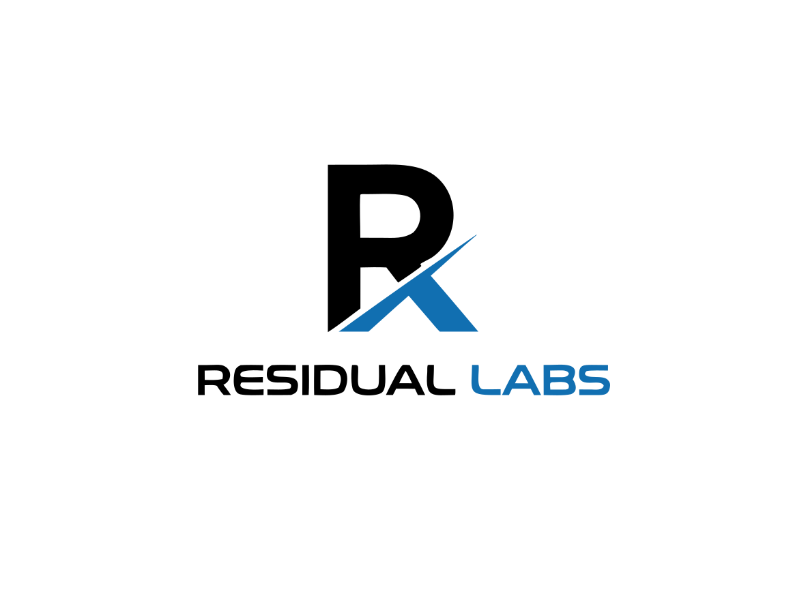

  
   
  <h1>Zakaria Gharzouli</h1>
  <h3>Solo Founder & Systems Architect @ <a href="https://residual-labs.fr">Residual Labs</a></h3>
  
<i>Architecting robust, zero-maintenance B2B SaaS ecosystems.</i>

---

## 🧠 About Me
I build highly scalable, automated digital ecosystems. My work focuses on replacing repetitive workflows with intelligent, asynchronous systems. I design products with a strict adherence to security, performance, and clean architecture.

## ⚡ Flagship Project: SPARDA (v0.12.0)
[**SPARDA**](https://github.com/zyx77550/sparda) is the flagship open-source compiler, simulator and proof engine of Residual Labs.

> **"Compile any backend into a deterministic behavior runtime."**
> Map Express, FastAPI, Next.js, Prisma, or any OpenAPI spec into a behavioral graph (SBG) to run mock servers, verify security constraints, and connect AI agents locally.

* **ubg --openapi** : Compile Go, Java, Rails, Laravel, or .NET APIs into the graph format.
* **mirror** : Host a mock HTTP simulation server directly from `ubg.json` (no code required, enforces guards).
* **timeless** : Record production execution context and export error traces as Vitest unit tests to replay/fix bugs locally.
* **apocalypse** : Statically prove route security and transactions in your CI/CD (SARIF format for GitHub Security).
* **verify** : Prove compilation soundness and round-trip laws deterministically.

---

## 🚀 The Residual Ecosystem
A suite of interconnected B2B platforms built to operate autonomously:
- [**SPARDA**](https://github.com/zyx77550/sparda) — Universal backend compiler, MCP bridge, and executable VM.
- [**Residual Audit**](https://audit.residual-labs.fr) — Automated technical & commercial web auditing engine (30+ OSINT sources, AI-driven reporting).
- [**Residual Reach**](https://reach.residual-labs.fr) — High-performance B2B outreach & workflow automation.
- [**Residual Publish**](https://publish.residual-labs.fr) — Data-driven, cross-platform SEO content generation.
- [**Residual QR**](https://qr.residual-labs.fr) — Dynamic tracking and offline tracking analytics infrastructure.

---

## ⚙️ Engineering Philosophy
- **Security First:** Strict Row-Level Security (RLS), Bring Your Own Key (BYOK) architecture, and AES-256-GCM encryption.
- **Extreme Automation:** Complex workflows delegated to robust background engines.
- **Zero-Bullshit UX:** Minimalist, functional, and fast interfaces.

## 🛠️ Core Stack

  
  
  
  
  
  

 

  
  
  

