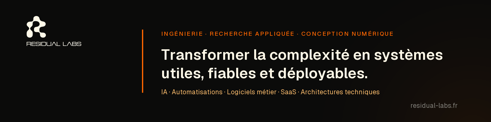
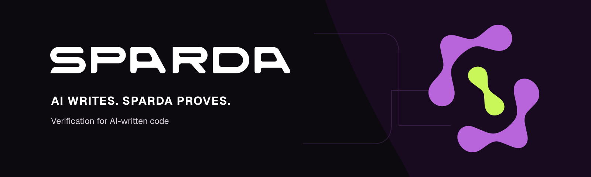

  

<h1 align="center">Zakaria Gharzouli</h1>

  <strong>Founder &amp; Principal Engineer at <a href="https://residual-labs.fr/">Residual Labs</a></strong> 
  Systems · Verification · Applied AI

  
  
  
  

<em>When the noise clears, the system remains.</em>

---

## About

I design software systems for work that cannot rely on approximation alone:
tools that are inspectable, deterministic where it matters, and explicit about
their limits.

My work sits at the intersection of AI, software architecture, automation, and
verification — turning complex behaviour into systems that teams can understand,
test, and operate with confidence.

---

## SPARDA

  

[**SPARDA**](https://github.com/zakariagharzouli/sparda) is the verification layer for
AI-written code.

> **AI writes. SPARDA proves.**

SPARDA compiles an application's declared behaviour into a deterministic graph.
It gives developers and AI agents a concrete model to inspect changes, verify
constraints, simulate APIs, and trace what a system is allowed to do.

  
